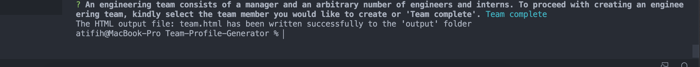

# Team-Profile-Generator

## Table of Contents
  * [Description](#description)
  * [Installing Dependencies](#installing-dependencies)
  * [Usage](#usage)
  * [License](#license)
  * [Contributing](#contributing)
  * [Tests](#tests)
  * [Questions](#questions)

## Description
I am building a Node CLI that takes in information about employees and generates an HTML webpage that displays summaries for each person. Given that testing is a key piece in facilitating  code to be  maintainable, I am ensuring that all unit tests pass.

The application may be invoked from the command line like so:
**node app.js**

## Installing Dependencies
 Dependencies maybe installed as follows:
 **npm i**

## Usage
  

  
The application begins by informing the user that they need to select an Engineering Team before they can view information in relation to them. The default selection of Manager is provided (for convenience).
 

  
The user then proceeds by selecting a manager, engineer, intern or team complete (when they have finished with the team selection). This is also the menu they are redirected  to after a team member has been created/selected  or when the user deems the team to be complete. The application features user input validation via the usage of regular exprssions.

Finally, the user informed of if a file has been successfully created (and it's location) or informed of an error message.
 cted 

 Rendering of the output HTML file.

## License
MIT.
 
## Contributing
All pull requests are allowed/encouraged. For developers looking to make profound changes to this project, kindly open an issue detailing any proposed changes to be made so that a discussion may ensue.
 
## Tests
Unit tests are provided and located in the test folder within the repository. The unit tests are invoked by: 
**npm run test**

## Questions
[Developer GitHub profile link](https://github.com/atifih)  
[Developer Email link](mailto:atif.haque@gmail.com)  
[Video demonstration of the application](https://drive.google.com/file/d/1Ebs_cqdhx2Y1BZ86jdnBwH6snvOJ7whg/view)  
[Sample output file generated](output/sampleTeam.html)

